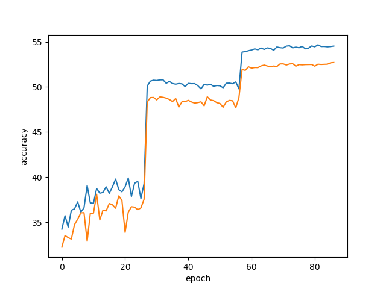
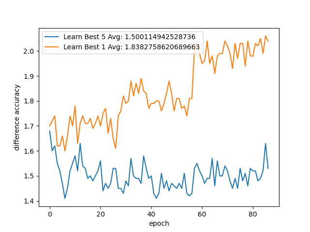

# AdaptiveLearnableLPPool2d-test
This is a Test on how pytorch models Perform if you make the p in LPPool2d learnable based on pytorch/examples/imagenet

### New Function

This adds the Option --LLPP. --LLPP replaces the last pooling layer with an AdaptiveLearnableLPPool2d layer.
It is only implemented for ShuffleNetV2 ResNet Inception3 GoogLeNet MobileNetV2 DenseNet and only tested for shufflenet_v2_x0_5.

### Tests

All tests where made with shufflenet_v2_x0_5 as test data imagenet was used but only folder that have more than 1500 images in them and only images that don't have iframe in them where used. 50 of them where used for validation.

### Results

Acc1 was around 1.9 % better and Acc5 around 1.5 %

Acc1 while Learning:

Acc5 while Learning:

Acc1 on Validation:

Acc5 on Validation:

Diff for Learning

Diff for Validation

The distribution of the Values in self.p after 90 epochs:

before self.m:

after self.m:

### Todo

Make the function work with negative values.
Best initialization for p values?
Best function for m?
Test if it can be used for other downsamplings in resnet downsampling for example?
Looks like the pool wants to suppress some of the value at the edge maybe multiply all of the input data points with a learnable value or just the edges?
Is it a good idea to concatenate a learnable tensor to the input before a conv is used?
What effect dose RandomResizedCrop with a min of 0.08 have on the data as a bigger value may be better?
What effect dose wait weight decay have on the new pooling layer?
